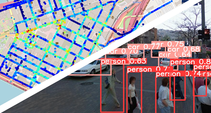

<p align="center">

</p>

<p align="center">

 
 

</p>

This YoloV5 based model is fit to detect people and different types of land vehicles,<br /> and displaying their density on a fitted map, according to their coordinates and detected labels. <br />


**Features:**

- Multiple Objects Detection
- Trained on 3,000 street view Images
- Exports Fitted and adjustable Maps
- Calculates a density score according to image detected labels 


<p align="center">
  
</p>


## Requierments:
- in order to plot the map: ```pip install mplleaflet ```
- to use YoloV5, see: [Yolov5_requirements](https://github.com/lironbdolah/streetdensityai/blob/main/src/yolov5/requirements.txt)
- 


## Usage

****Object Detection:**** 

identifies people and land vehicles in your images:

```shell
python src/yolov5/detect.py --source  <path to images folder> --project <output path>
--name <output folder name> --save-txt --conf 0.3
```
running this action will save your images with the anchor boxes around objects that the model found:


(if you don't want to save the labeled images, just add  ```--nosave ``` to the command above)
in addition, it will save the detected object labels for each image.


 ****Plotting a fitted map:****
 
 display the density on a fitted map (requires a .csv file)
 
```shell
python src/steetdensityai.py --labels <labels path that were created after the images detection>
--coordinates <path-to-csv/file.csv>  --images <path to images folder>
--img-per-cord 1 --output <output path>
```


#### notes
- csv requires 2 columns to display the coordinates named: "longitude" and "latitude"
- the code asumes that the coordinates are sorted by the image's name.
- If you have multiple images per coordinate (for example if you have a 360 view, divided to 4 images), you can set the number of images per coordinate with : ```--img-per-cord <integer of images per coordinate > ```

 
## Simple Example

```shell
# detect objects: 
python src/yolov5/detect.py --source  example/images --project example/images
--name detected_images --save-txt --conf 0.4

# creates a label folder in example/images/detected_images named "labels"
# saves the images with the newly found objects anchor, and each image labels 


#plot desnity map
python src/steetdensityai.py --labels example/images/detected_images/labels
--coordinates example/coordinates.csv  --images example/images
--img-per-cord 4 --output example/images                                     # will save the map.html file to example/images


```

