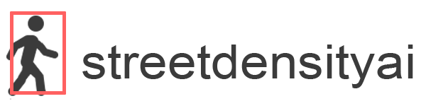

# streetdensityai

<p align="center">

</p>

<p align="center">
  
  <a href="https://github.com/aporia-ai/streetdensityai/issues"></a>
  

</p>

No need bla bla take a loop at what is busy

<p align="center">
  
</p>

**Features:**
- Features 1
- Features 2

### How to run

****Step 1:**** 

identifies people and land vehicles in your images:

```shell
python src/yolov5/detect.py --source  <path to images folder> --project <output path>
--name <output folder name> --save-txt --conf 0.3
```
running this action will save your images with the anchor boxes around objects that the model found:


in addition, it will save the detcted object labels for each image.


 ****Step 2:****
 
 display the density on a fitted map (requiers as csv file with the coordinats)
 
```shell
python src/steetdensityai.py --labels <labels path that were created after the images detection>
--coordinates <path-to-csv/file.csv>  --images <path to images folder>
--img-per-cord 1 --output <output path>
```

#### notes
- csv requires 2 columns to display the coordinates named: "longtitude" and "lattitude"
- the code asuumes that the coordinates are sorted by the images name.
- If you have multiple images per coordinate (for example if you have a 360 view, divided to 4 images),you can set the amount of images per coodinate with : ```--img-per-cord <integer of images per coordinate > ```

 

